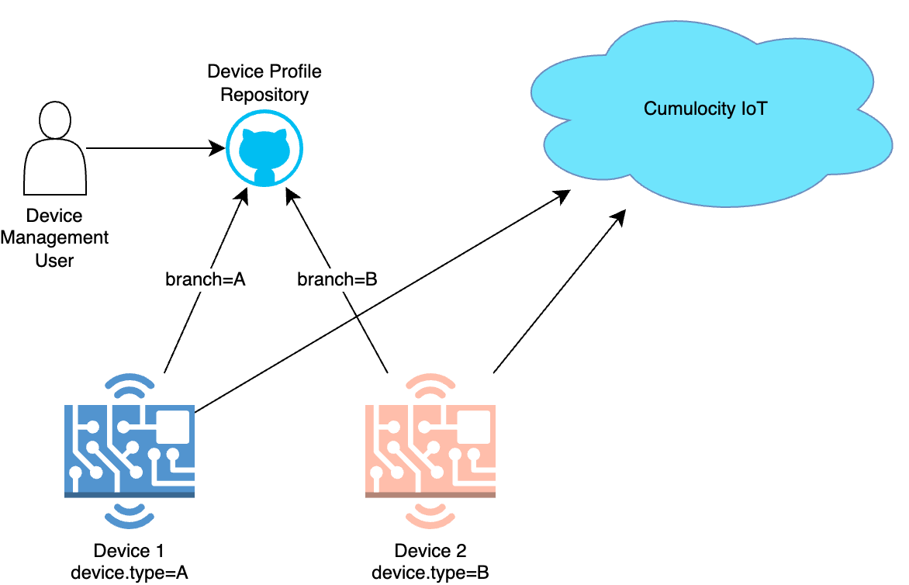
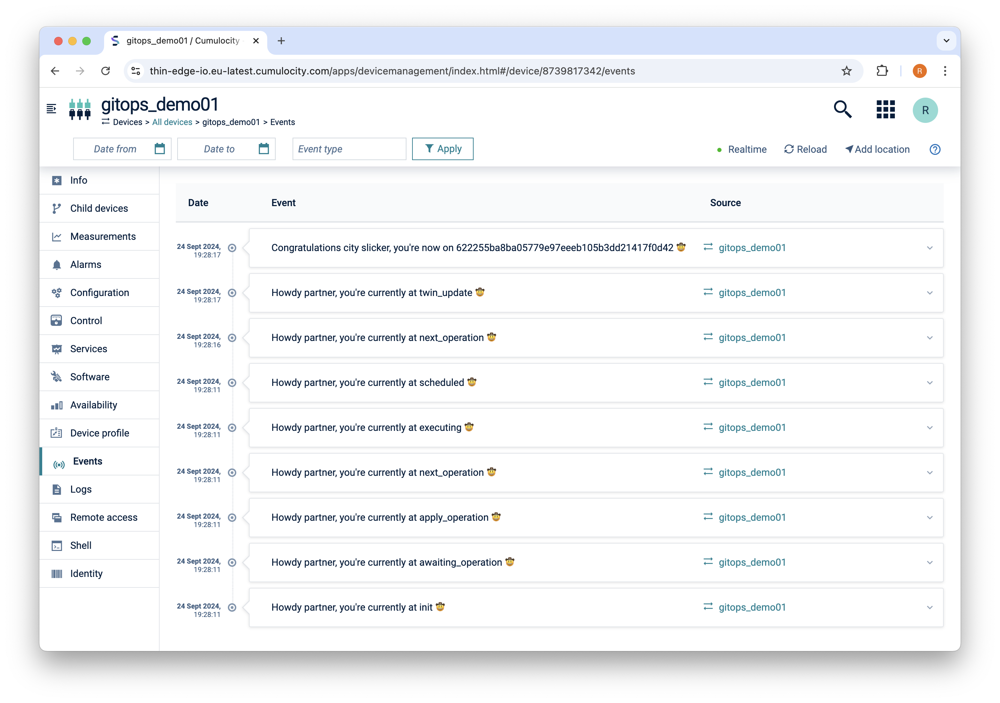
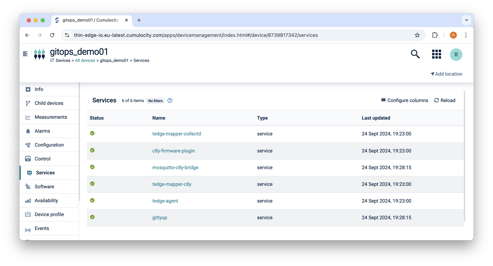

# gittyup

Hackathon project to perform device management using GitOps!




The flow is simple;

1. Clone the configuration git repository
2. Update the git repository (e.g. `git pull`)
3. Apply device profile using local thin-edge.io operation

That's it. Now, if you make changes to the configuration git repository, then gittyup will fetch the change and apply the changes.

Information about the device, like what repo/branch/commit is applied on the device is stored on the digital twin. Below shows an example of this information:

```json
{
    "gittyup": {
        "commit": "fd296db59f94ad46b370a02ac74250f03bb1af54",
        "branch": "tedge_rugpi_rpi-tryboot-containers",
        "url": "https://github.com/thin-edge/gittyup-linux-mainstream.git"
    }
}
```

Or you can check the status locally on the thin-edge.io MQTT broker using the following command:

```sh
tedge mqtt sub te/+/+/+/+/twin/gittyup
```

## Installation and configuration


1. Install the gittup service

    ```sh
    apt-get update
    apt-get install gittyup
    ```

    **Note**

    If apt can't find the package, then you will need to run the following command to setup the thin-edge.io community repository:

    ```sh
    curl -1sLf \
    'https://dl.cloudsmith.io/public/thinedge/community/setup.deb.sh' \
    | sudo -E bash
    ```

2. Configure the git repository which

    **file: /etc/gittyup/config.toml**

    ```toml
    [repository]
    url = "https://github.com/thin-edge/gittyup-linux-mainstream.git"
    # Optional branch, otherwise the tedge device.type will be used as the branch name
    # branch = "main"
    ```

    You can fork the [gittyup-linux-mainstream](https://github.com/thin-edge/gittyup-linux-mainstream) repository to build your own.

3. Start/restart the service

    ```sh
    systemctl enable gittyp.service
    systemctl start gittyp.service
    ```


## Screenshots

Events are used to show progress when a device profile is being applied locally.



And you can check if the gittyup service is functional by checking the status on the service page.



